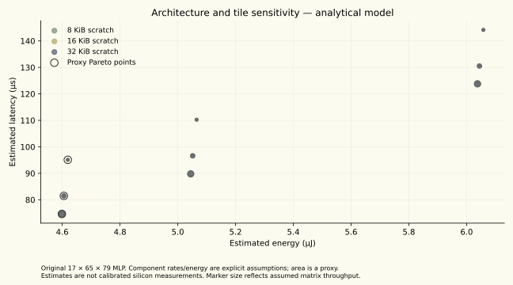

# Recorded compiler and architecture study

October 5, 2026. Original 17 × 65 × 79 residual MLP. Both generated binaries agree with the numerical reference.

| Schedule | Estimated cycles | Estimated latency |
|---|---:|---:|
| Serial DMA | 20384 | 101.920 µs |
| Double-buffered DMA | 17237 | 86.185 µs |

The comparison holds the 32 KiB scratch budget and compute/DMA assumptions fixed. The modeled clock is 200 MHz, with 16 MACs/cycle and 16 DMA bytes/cycle. These are analytical estimates, not physical accelerator timings.

The study also records compiler sizes/timings, architecture/tile sweeps and bandwidth/energy sensitivity. The area quantity is an illustrative proxy. Peak RSS is cumulative within a process; initial compile timings are observations rather than a complexity proof. [Aggregate data](../results/architecture-results.json).

Functional tests cover the PyTorch-exported CNN, serial and buffered schedules, logical FP16, corrupt binaries, repeated requests and the IREE VM bridge. The software exposes a generic matrix fallback for depthwise convolution so a native hardware feature can be compared with a less specialized mapping. Its area cost is not calibrated.

